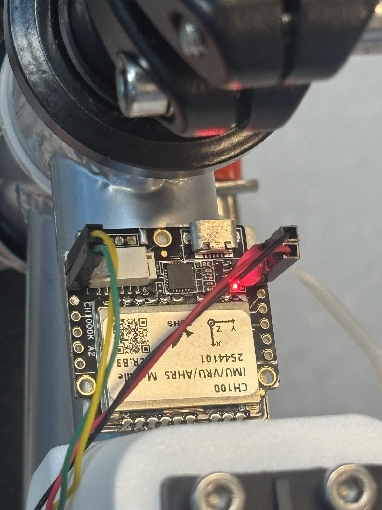
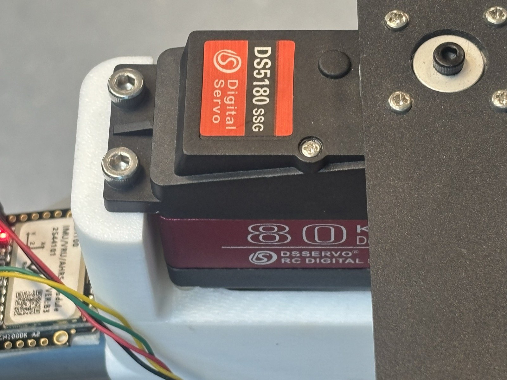
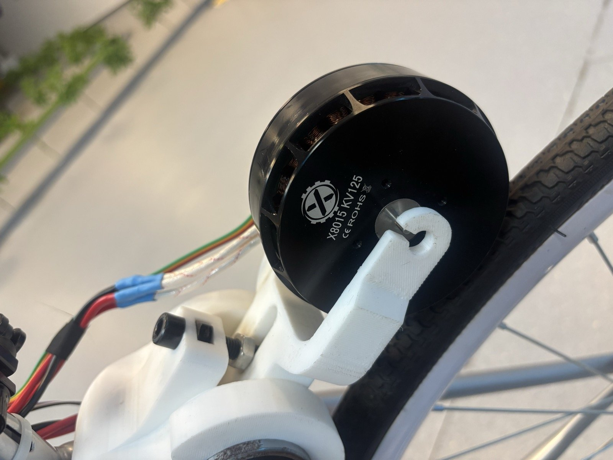
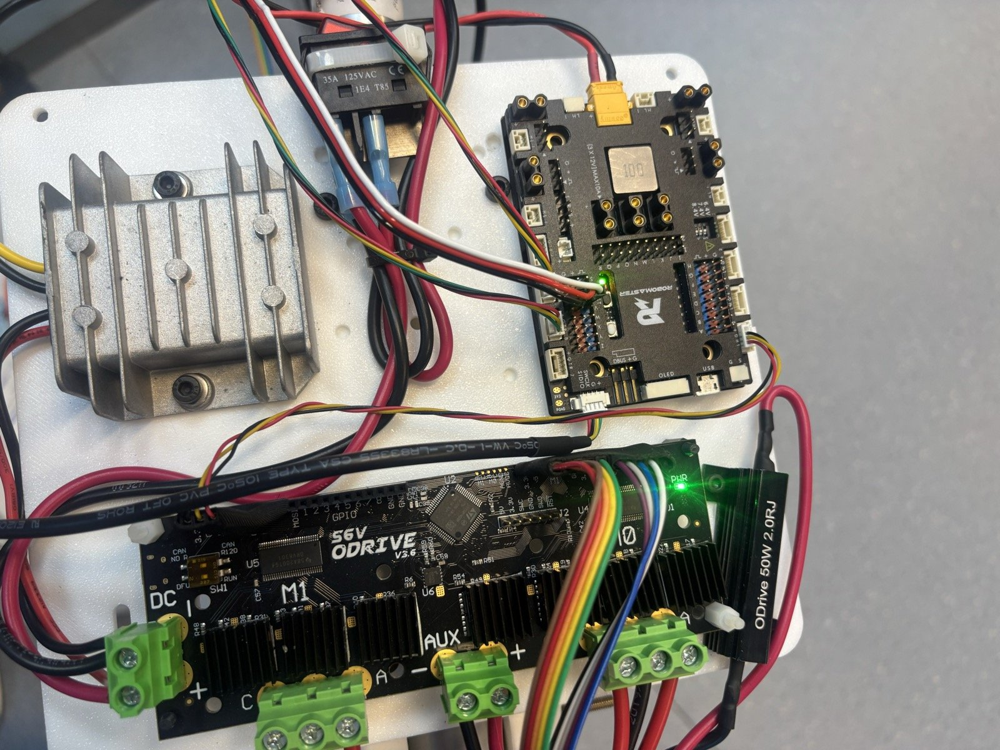
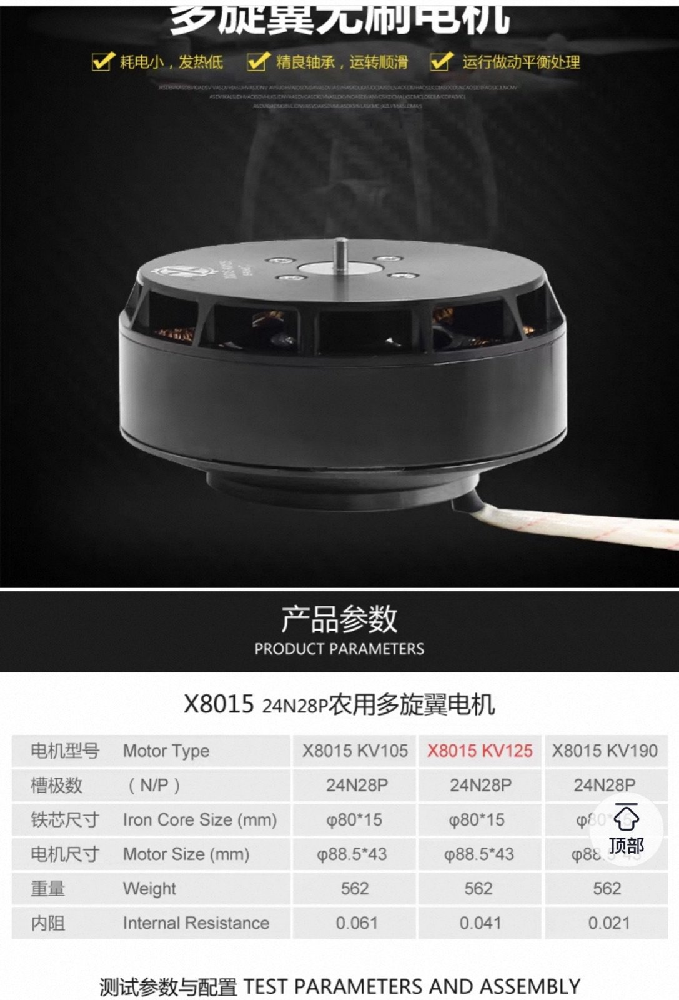
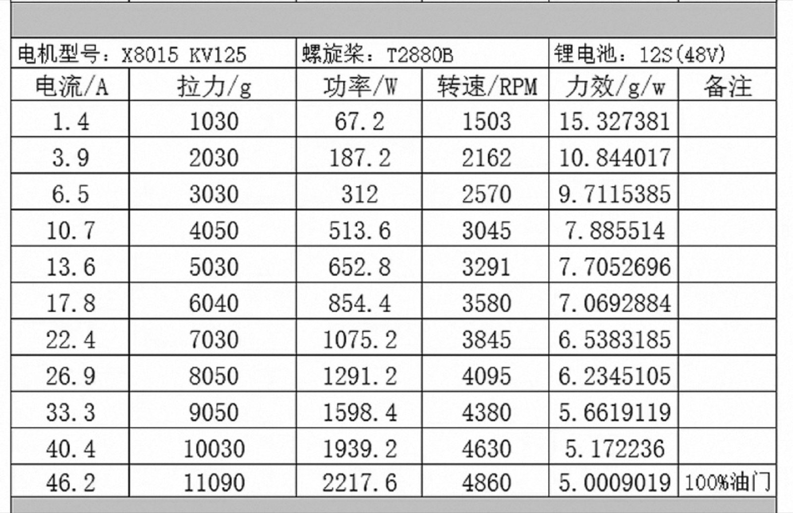

# 硬件与电气说明

本文记录已经由源码、厂家资料或实拍确认的硬件。无法确认的参数会明确标为“待确认”，避免将推测写成事实。

## 1. 硬件清单

| 子系统 | 已确认型号/版本 | 作用 | 证据 |
| --- | --- | --- | --- |
| 主控 | RoboMaster A 型开发板，STM32F427IIH6，UFBGA176 | 实时控制、传感器解析、CAN、PWM、遥测 | 芯片丝印、`bike.ioc` |
| 调试器 | ST-LINK/V2 | SWD 下载与调试 | 实拍 |
| IMU | CH100 IMU/VRU/AHRS 模块 | 横滚角与三轴角速度 | 模块标签、UART8 解码源码 |
| 电机控制器 | ODrive Robotics 56 V v3.6，双轴 | 驱动动量轮和后轮无刷电机 | 实拍、USB 识别、配置 |
| 制动电阻 | 50 W / 2 Ω | ODrive 回生制动能量耗散 | 实拍标签 |
| 动量轮电机 | X8015 KV125，24N28P | 产生横滚方向反作用力矩 | 电机丝印、厂家参数图 |
| 后轮电机 | X8015 KV125，同型 | 行驶驱动 | 用户确认 |
| 转向舵机 | DS5180 SSG Digital Servo | 前轮转向 | 舵机标签 |
| 编码器 | 增量式，8192 CPR | ODrive 速度反馈 | 当前实车配置 |
| 电池 | 12S/约 48 V 系统 | ODrive 与动力供电 | 厂家测试资料；实车电池细节待确认 |
| 机械结构 | 含 3D 打印件 | 固定动量轮、IMU 与控制器 | 用户说明与实拍 |

硬件实拍位于 `docs/assets/hardware/`。照片用于辨识型号和接线位置，不替代电气原理图。

| CH100 IMU | DS5180 舵机 |
| --- | --- |
|  |  |

| X8015 KV125 | 控制板与 ODrive |
| --- | --- |
|  |  |

## 2. 主控与时钟

- MCU：STM32F427IIH6。
- 内核：Arm Cortex-M4F。
- 外部高速晶振：12 MHz。
- 系统时钟：168 MHz。
- AHB：168 MHz。
- APB1：42 MHz，APB1 定时器时钟 84 MHz。
- APB2：84 MHz，APB2 定时器时钟 168 MHz。
- 内部 Flash：2 MiB；当前链接脚本只给固件分配前 1792 KiB。
- SRAM：192 KiB 普通 SRAM + 64 KiB CCMRAM。当前链接脚本的常规数据区使用 192 KiB SRAM。

最后两个 128 KiB Flash 扇区保留给动态零点记录：

| 扇区 | 地址范围 | 用途 |
| --- | --- | --- |
| 22 | `0x081C0000–0x081DFFFF` | 零点追加日志 A |
| 23 | `0x081E0000–0x081FFFFF` | 零点追加日志 B |

不要用全片擦除后只写部分镜像的方式维护零点；普通固件映像起始地址是 `0x08000000`，且链接器保证不会覆盖上述保留区。

## 3. 动量轮与后轮电机

两个电机均为 X8015 KV125 外转子无刷电机。厂家图中给出的信息：

- 结构：24 槽 28 极（24N28P），ODrive 参数应使用 **14 极对**。
- KV：125 rpm/V。
- 铁芯：约 `φ80 × 15 mm`。
- 外形：约 `φ88.5 × 43 mm`。
- 重量：约 562 g。
- 内阻：约 0.041 Ω。
- 厂家 12S/48 V 螺旋桨台架表给出最高约 4860 rpm、46.2 A、2217.6 W；这是特定螺旋桨负载下的数据，不是本车结构的安全上限。

厂家规格截图：

| 型号与结构 | 12S 台架数据 |
| --- | --- |
|  |  |

### 动量轮物理原理

电机给动量轮施加角加速度时，车架受到方向相反的反作用力矩。控制目标因此是根据车体横滚角和横滚角速度改变轮的加速度；持续单向轮速本身不能无限提供平衡力矩，反而会走向转速饱和。

### 机械安全边界

动量轮支架含 3D 打印件，目前没有材料、层向、填充率、轴承座和紧固件的完整强度验证。因此：

- 不得直接把 50 tps、120 A 或厂家满油门数据当作允许值。
- 调参前检查飞轮同心度、紧固件防松、轴承间隙和打印件裂纹。
- 逐级提高加速度，并记录振动、电流、温升和结构变形。
- 飞轮旋转平面必须使用防护罩或物理隔离区。
- 设置软件限幅前，应先确定可接受的最大电流、轮速、加速度和加加速度。

## 4. ODrive

- 硬件：ODrive 56 V v3.6。
- 固件：实车连接时识别为 0.5.6。
- Axis 0：动量轮，CAN node ID `24`（`0x18`）。
- Axis 1：后轮，CAN node ID `16`（`0x10`）。
- CAN：250 kbit/s。
- 编码器：增量式，8192 CPR。
- 电机极对：14。
- 控制模式：速度控制。
- 输入模式：速度斜坡。
- 配置中的速度上限：50 turns/s。
- 配置中的速度斜坡率：50 turns/s²。
- 配置中的电流上限：120 A。

上述是厂家文本与已连接实车上读到/确认的配置摘要，不代表安全推荐值。特别是 120 A 明显高于当前机械系统未经验证的安全能力，应在后续安全状态机阶段降低并实测。

仓库中的 `hardware/vendor/config_8192cpr_20PP_reference.json` 是厂家提供的另一份参考备份，其中使用 20 极对、node ID 0/1、20 A 等配置，与当前车不一致。禁止直接 `restore-config` 到当前 ODrive。

## 5. CH100 IMU

- 接口：UART8。
- 波特率：460800，8N1。
- STM32 接收：PE0 / UART8_RX。
- STM32 发送：PE1 / UART8_TX。
- 固件使用 CH100 数据帧中的欧拉角和角速度；横滚角为 `imu.rol`，横滚角速度为 `imu.vx`。
- 横滚角速度当前使用一阶低通，系数 `alpha = 0.5`。

IMU 未刚性固定、安装角变化、轮胎气压和地面倾斜都会改变最佳平衡零点，这是动态零点存在的原因。IMU 安装仍应尽量刚性可靠；动态零点不能代替松动检测。

## 6. 转向舵机

- 型号：DS5180 SSG Digital Servo。
- 控制：TIM2 Channel 3，PA2，50 Hz PWM。
- 定时器计数分辨率：1 µs；周期 20 ms。
- 当前中位值：780 µs。
- 当前软件范围：580–980 µs，对应 `duty = -200…+200`。

这里记录的是源码中的实际脉宽，而不是舵机厂商的通用范围。中位和机械极限必须结合当前连杆重新确认，避免舵机堵转。

## 7. 调试与供电

### SWD

使用四线连接：

| ST-Link | 主控 |
| --- | --- |
| SWDIO | PA13 / SWDIO |
| SWCLK | PA14 / SWCLK |
| 3V3 / VTref | 3.3 V 参考 |
| GND | GND |

主控板没有方便连接的 NRST 不妨碍正常烧录；ST-Link 可通过 SWD 请求系统复位。3V3 主要作为目标电压参考，除非已经明确供电方案，否则不要用调试器给整车动力系统供电。

### 电源

- ODrive 动力侧是高能量 48 V 级系统。
- 图中电源分配板有 6.4/7.4/8.4 V 选择和 12 V 输出，但当前仓库没有完整接线图，具体负载分配待补录。
- 使用 50 W / 2 Ω 制动电阻时，必须确认 ODrive 的制动电阻配置、散热和最高母线电压。
- USB-UART 与 ST-Link 都必须和主控共地；不要重复连接多个 5 V/3.3 V 电源输出。

## 8. 尚待测量和补录

- 电池具体型号、容量、持续/峰值放电倍率、保险丝规格。
- 动量轮飞轮质量、半径、转动惯量、最大允许转速与防护罩等级。
- 3D 打印材料、打印方向、填充率和结构安全系数。
- DS5180 的实际供电电压、电流峰值、左右机械极限和转角映射。
- CH100 的固件版本、输出协议版本、安装坐标变换和温漂测试。
- CAN 收发器型号、终端电阻位置和总线长度。
- 后轮传动比、轮径、轮胎压力与速度换算。
- 整车质量、质心高度和惯量参数。
